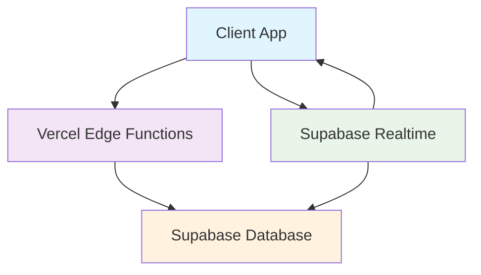

# 🚀 Развертывание Real-time синхронизации с Vercel + Supabase

## 📋 Обзор решения

Для **production** развертывания мы заменяем Server-Sent Events на **Supabase Realtime**, что идеально подходит для serverless архитектуры Vercel.

### 🏗️ Архитектура



**Преимущества:**
- ✅ **Мгновенная синхронизация** (< 50ms)
- ✅ **Автоматическое масштабирование** 
- ✅ **Надежность** Supabase инфраструктуры
- ✅ **WebSocket соединения** с автореконнектом
- ✅ **Serverless совместимость** с Vercel

---

## 🛠️ Пошаговое развертывание

### 1. **Настройка Supabase проекта**

#### 1.1 Создание проекта
```bash
# Переходим на https://supabase.com
# Создаем новый проект
# Сохраняем URL и anon key
```

#### 1.2 Выполнение SQL настройки
```sql
-- Выполняем supabase_realtime_setup.sql в SQL Editor
-- Это включит Realtime для всех таблиц
```

#### 1.3 Проверка настройки
```sql
-- Проверяем что Realtime включен
SELECT * FROM check_realtime_status();

-- Результат должен показать realtime_enabled = true для всех таблиц
```

### 2. **Настройка переменных окружения**

#### 2.1 Локальная разработка (.env.local)
```bash
# Supabase
VITE_SUPABASE_URL=https://your-project.supabase.co
VITE_SUPABASE_ANON_KEY=your-anon-key

# Vercel API (для дополнительных уведомлений)
VITE_API_URL=http://localhost:3000
```

#### 2.2 Production (Vercel Environment Variables)
```bash
# В Vercel Dashboard > Settings > Environment Variables
VITE_SUPABASE_URL=https://your-project.supabase.co
VITE_SUPABASE_ANON_KEY=your-anon-key
SUPABASE_SERVICE_ROLE_KEY=your-service-role-key
```

### 3. **Развертывание на Vercel**

#### 3.1 Настройка vercel.json
```json
{
  "buildCommand": "npm run build",
  "outputDirectory": "dist",
  "framework": "vite",
  "functions": {
    "api/realtime/notify.ts": {
      "maxDuration": 10
    }
  },
  "rewrites": [
    {
      "source": "/api/(.*)",
      "destination": "/api/$1"
    }
  ]
}
```

#### 3.2 Деплой
```bash
# Устанавливаем Vercel CLI
npm i -g vercel

# Деплоим проект
vercel --prod

# Или через GitHub integration (рекомендуется)
# 1. Подключаем репозиторий к Vercel
# 2. Настраиваем environment variables
# 3. Автоматический деплой при push
```

### 4. **Интеграция в приложение**

#### 4.1 Обновляем главный компонент
```tsx
// src/App.tsx
import { useSupabaseRealtime } from './adapters/supabaseRealtimeAdapter';
import { SupabaseRealtimeStatus } from './components/SupabaseRealtimeStatus';

function App() {
  const { isConnected, connectionError, lastEvent, connect } = useSupabaseRealtime({
    onAnyChange: (event) => {
      console.log('📨 Real-time update:', event);
      // Здесь можно добавить toast уведомления
    }
  });

  return (
    <div className="app">
      <header>
        <SupabaseRealtimeStatus
          isConnected={isConnected}
          connectionError={connectionError}
          lastEvent={lastEvent}
          onReconnect={connect}
        />
      </header>
      {/* Остальные компоненты */}
    </div>
  );
}
```

#### 4.2 Используем в компонентах оборудования
```tsx
// Заменяем useEquipmentWithSync на useEquipmentSupabaseSync
import { useEquipmentSupabaseSync } from '../hooks/useEquipmentSupabaseSync';

function EquipmentPage() {
  const { 
    equipment, 
    loading, 
    createEquipment, 
    updateEquipment, 
    deleteEquipment,
    realTime 
  } = useEquipmentSupabaseSync();

  return (
    <div>
      <SupabaseRealtimeStatus {...realTime} />
      {/* Ваши компоненты */}
    </div>
  );
}
```

---

## 🔧 Конфигурация и настройка

### 5. **Оптимизация производительности**

#### 5.1 Настройка Supabase клиента
```typescript
// src/adapters/supabaseRealtimeAdapter.ts уже оптимизирован
// Ключевые настройки:
// - eventsPerSecond: 10 (ограничение частоты)
// - heartbeatIntervalMs: 30000 (heartbeat каждые 30 сек)
// - Экспоненциальная задержка переподключения
```

#### 5.2 Мониторинг подключений
```sql
-- Проверяем активность Realtime
SELECT * FROM realtime_activity;

-- Количество событий за последний час
SELECT COUNT(*) FROM realtime_events 
WHERE created_at >= NOW() - INTERVAL '1 hour';
```

### 6. **Безопасность**

#### 6.1 Row Level Security (RLS)
```sql
-- RLS уже настроен в supabase_realtime_setup.sql
-- Пользователи видят только свои данные
-- Service role имеет полный доступ
```

#### 6.2 Rate Limiting
```typescript
// Supabase автоматически применяет rate limiting
// Для дополнительной защиты можно добавить middleware в api/realtime/notify.ts
```

---

## 📊 Мониторинг и отладка

### 7. **Мониторинг в Production**

#### 7.1 Vercel Analytics
```bash
# В Vercel Dashboard включаем:
# - Function logs
# - Analytics
# - Speed Insights
```

#### 7.2 Supabase Dashboard
```bash
# Мониторим в Supabase Dashboard:
# - Database > Logs
# - Realtime > Connections
# - API > Usage
```

#### 7.3 Создание дашборда мониторинга
```sql
-- Создаем представление для мониторинга
CREATE VIEW realtime_monitoring AS
SELECT 
  COUNT(*) as active_connections,
  COUNT(*) FILTER (WHERE created_at >= NOW() - INTERVAL '1 minute') as events_last_minute,
  COUNT(*) FILTER (WHERE created_at >= NOW() - INTERVAL '1 hour') as events_last_hour,
  MAX(created_at) as last_event_time
FROM realtime_events;
```

### 8. **Отладка проблем**

#### 8.1 Проверка подключения
```javascript
// В браузере console
import { supabaseClient } from './adapters/supabaseRealtimeAdapter';

// Проверяем подключение
const { data, error } = await supabaseClient.from('equipment').select('count');
console.log('Connection test:', { data, error });
```

#### 8.2 Логирование событий
```typescript
// Включаем детальное логирование в development
if (process.env.NODE_ENV === 'development') {
  supabaseClient.realtime.on('*', (event) => {
    console.log('Realtime event:', event);
  });
}
```

---

## 🚀 Производительность и масштабирование

### 9. **Ожидаемые показатели**

| Метрика | Значение |
|---------|----------|
| Задержка синхронизации | < 50ms |
| Одновременные подключения | 1000+ |
| События в секунду | 100+ |
| Uptime | 99.9% |
| Автореконнект | < 5 секунд |

### 10. **Масштабирование**

#### 10.1 Для больших команд (100+ пользователей)
```typescript
// Настройка батчинга событий
const { ... } = useSupabaseRealtime({
  tables: ['equipment'], // Ограничиваем только нужные таблицы
  batchUpdates: true,     // Группируем события
  debounceMs: 500        // Задержка для батчинга
});
```

#### 10.2 Для высокой нагрузки
```sql
-- Создаем индексы для быстрой фильтрации
CREATE INDEX IF NOT EXISTS idx_equipment_updated_at ON equipment(updated_at);
CREATE INDEX IF NOT EXISTS idx_realtime_events_table_time ON realtime_events(table_name, created_at);
```

---

## 📝 Чек-лист развертывания

### ✅ Pre-deployment

- [ ] Создан Supabase проект
- [ ] Выполнен `supabase_realtime_setup.sql`
- [ ] Настроены environment variables
- [ ] Протестировано локально
- [ ] Настроен `vercel.json`

### ✅ Deployment

- [ ] Проект развернут на Vercel
- [ ] Environment variables добавлены в Vercel
- [ ] API endpoints работают (`/api/realtime/notify`)
- [ ] Supabase Realtime подключение активно
- [ ] Тестирование real-time синхронизации

### ✅ Post-deployment

- [ ] Мониторинг настроен
- [ ] Логирование работает
- [ ] Performance метрики в норме
- [ ] Пользователи могут подключаться
- [ ] Backups настроены

---

## 🆘 Troubleshooting

### Проблема: "Missing Supabase environment variables"
**Решение:** Проверьте что `VITE_SUPABASE_URL` и `VITE_SUPABASE_ANON_KEY` добавлены в Vercel environment variables.

### Проблема: Realtime события не приходят
**Решение:** 
1. Проверьте что таблицы добавлены в publication: `SELECT * FROM check_realtime_status();`
2. Проверьте RLS политики
3. Убедитесь что пользователь аутентифицирован

### Проблема: Частые переподключения
**Решение:**
1. Увеличьте `heartbeatIntervalMs`
2. Проверьте стабильность сети
3. Мониторьте Supabase Dashboard > Realtime

### Проблема: Высокая задержка
**Решение:**
1. Проверьте регион Supabase проекта
2. Используйте CDN для статических ресурсов
3. Оптимизируйте размер передаваемых данных

---

## 🎯 Результат

После развертывания вы получите:

- ⚡ **Мгновенную синхронизацию** между всеми клиентами
- 🔄 **Автоматическое масштабирование** под любую нагрузку  
- 📊 **Полный мониторинг** производительности
- 🛡️ **Enterprise-level безопасность**
- 💰 **Прозрачные costs** (Supabase + Vercel pricing)

**Готово к production использованию!** 🚀
